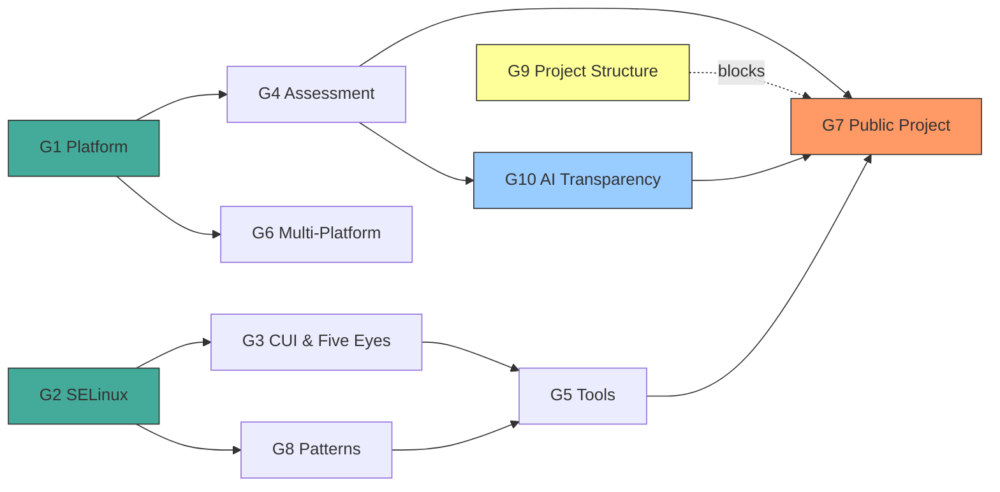

# UMRS ROADMAP

**Updated:** 2026-03-15

High-assurance Rust platform for system security on Linux.
Typed, provenance-verified answers about what a system is, what it runs, and whether it meets policy.

---

## How We Got Here

Started with MLS labeling of CUI — one library, one problem.
That led to discovering high-assurance programming patterns (TPI, TOCTOU, provenance).
Which led to high-assurance operations — tools that demonstrate those patterns.
Which led to strong security controls with real evidence backing everything.

Now UMRS is four interrelated things:
- **Libraries** — reusable Rust crates for SELinux, platform detection, MLS math
- **Patterns** — how to write high-assurance Rust, with real examples
- **Tools** — CLI tools for security operators
- **Assessment** — auditor-ready evidence with compliance backing

---

## Goals

- **G1 — Platform Awareness**: Know the system with proof (OS, kernel posture, CPU extensions, crypto)
- **G2 — SELinux / MLS Modeling**: Clean-room typed Rust for security contexts, MLS, lattice math
- **G3 — CUI & Five Eyes**: CUI labeling, CMMC, allied nation interop
- **G4 — Assessment Engine**: Auditor-ready evidence, findings, OSCAL export — not a scanner
- **G5 — Security Tools**: `umrs-ls`, `umrs-state`, `umrs-logspace` — enriched CLI tools
- **G6 — Multi-Platform**: RHEL primary, Ubuntu secondary, graceful degradation
- **G7 — Public Project**: Docs, CI/CD, crates.io, contribution guide, compelling narrative
- **G8 — High-Assurance Patterns**: The pattern library as a first-class product, not just docs
- **G10 — AI Transparency**: Document how AI agents are used, how knowledge is sourced, and how decisions trace back to authoritative material

### Goal Dependencies

- G1 feeds G4: platform awareness provides evidence for assessment
- G2 feeds G3: MLS modeling underpins CUI labeling
- G8 feeds G5: patterns are demonstrated through tools
- G4 + G5 feed G7: public project needs working assessment and tools
- G4 feeds G10: assessment methodology informs how we document AI knowledge provenance
- G10 feeds G7: AI transparency documentation is part of the public project story
- G9 blocks parts of G7: can't publish to crates.io without deciding repo structure

### G9 — Project Structure (decision pending)

The project may need to split into multiple repos for crates.io, GitHub Pages,
and contributor clarity. Decision captured in `.claude/plans/project-restructure.md`.
Not blocking current work. Blocks M4.

---

## Milestones

### M1 — Solid Foundation (current) (G1, G2, G8)
- [x] OS detection with trust tiers
- [x] SELinux modeling (SecurityContext, MLS, CategorySet, SecureDirent)
- [ ] Kernel posture probe complete (through Phase 2b)
- [ ] CPU corpus research complete
- [ ] Security-auditor methodology corpus ingested
- [ ] Documentation restructure complete

### M2 — Assessment Capable (G1, G4, G6)
- [ ] Assessment engine v1 (evidence/assertion/finding pipeline)
- [ ] OSCAL export working
- [ ] CPU extension detection (three-layer model)
- [ ] Multi-platform T3 on Ubuntu

### M3 — CUI Ready (G3)
- [ ] CUI label definitions
- [ ] MCS translation
      - Install utility to choose CUI categories and optional Five Eyes
- [ ] Five Eyes interop mapping
- [ ] French translations for all tool domains (Five Eyes demonstration)

### M4 — Public Release (G7, G9)
- [ ] Project structure decided (see G9)
      - May mean different GitHub repositories
      - Repository work needed
- [ ] README, getting-started guide, contribution guide
- [ ] CI/CD pipeline
- [ ] Core crates on crates.io
- [ ] Source code comments reviewed by tech-writer and security-auditor
- [ ] Documentation and API available on GitHub Pages

### M5 — AI Transparency (G10)
- [ ] Antora module: `ai-transparency`
- [ ] Agents and their roles
- [ ] Corpus/RAG setup — how we improved agents with authoritative knowledge
      - Document every collection, its sources, and why it exists
      - The pipeline: Jamie identifies knowledge gap → researcher acquires → corpus built →
        familiarization skill has target agent read it → agent produces grounded work
- [ ] Knowledge provenance: how security claims trace back to authoritative sources
- [ ] Roadmap, plans, tasks, and the jamies_brain/new-stuff intake concept
- [ ] Workflow and feedback — how we ensure agents get what they need
- [ ] Skills catalog — what each skill does and why it exists
- [ ] Evidence value — why this matters to auditors (decision traceability, source attribution)

---

## Operations & Tools

Tools are a primary deliverable — they demonstrate the patterns, produce the evidence,
and give operators something to run. The security-auditor owns operations documentation:
how tools are deployed, how often they run, what their output means, and how findings
are escalated.

### Tool Inventory

| Tool | Crate | Purpose | Status | Operates On |
|---|---|---|---|---|
| `umrs-ls` | `umrs-ls` | Security-enriched directory listing — SELinux labels, xattrs, security observations | Functional | Files, directories |
| `umrs-state` | `umrs-state` | System state introspection — kernel posture, platform detection, security signals | Prototype | Host system |
| `umrs-logspace` | `umrs-logspace` | Audit trail and logging — structured security event capture | Prototype | Audit events |

### Planned Tools

| Tool | Purpose | Depends On | Milestone |
|---|---|---|---|
| Posture probe CLI | Run kernel/CPU posture checks, produce evidence snapshots | G1 platform awareness, posture probe complete | M2 |
| Assessment reporter | Generate findings reports, OSCAL export | G4 assessment engine | M2 |
| Event viewer (TUI/GUI) | Read and display structured JSON event logs from journald; acknowledge events | G5 tools, event logging infrastructure | M2+ |
| CUI label installer | Choose CUI categories and optional Five Eyes markings | G3 CUI labeling | M3 |
| MCS translator CLI | Human-readable MCS category translation | G2 SELinux/MLS modeling | M3 |

### Interface Roadmap

All tools will progress through interface tiers as they mature:
- **CLI** — first delivery, scriptable, evidence-producing
- **TUI** — interactive terminal interface for operators
- **GUI** — eventual graphical interface for broader adoption

### Event Logging Architecture

All UMRS tools emit structured JSON events to systemd-journald. This is the foundation
for audit trails, prescribed routine audits, and the event viewer.

- **Transport**: systemd-journald (all tool binaries use `systemd-journald` logging)
- **Format**: Structured JSON event records
- **Configuration**: Jamie will provide journald/rsyslogd instructions for JSON structured log capture
- **boot_id**: Events are correlated by systemd boot_id for session continuity

**Event acknowledgement pattern:**
- Some log entries are marked as **acknowledgement required**
- Through the event viewer (TUI/GUI), an operator can acknowledge a previous event
- The acknowledgement is emitted as a **new event** that pairs with the original
- This creates an auditable acknowledgement chain: event → ack event, linked by boot_id
- Prescribed routine audits (per security-auditor recommendations) generate events
  that require operator acknowledgement

### Prescribed Routine Audits

The security-auditor defines prescribed audit routines — scheduled checks that tools
execute automatically per CA-7 monitoring frequency. These routines:
- Run posture checks, evidence collection, or compliance scans on a defined schedule
- Emit structured JSON events to journald
- Flag findings that require operator acknowledgement
- Produce evidence trails that satisfy assessment requirements (SP 800-53A)

### Operational Scope (security-* team owned)

The security-engineer, security-auditor, and guest-admin collectively own the operational
side of every tool. Developers build; the security team evaluates, defines operational
use, and drives enhancement.

**For each delivered tool, the security team:**
- **Evaluates output** — is the information correct, complete, and actionable for operators?
- **Evaluates usability** — across CLI, TUI, and GUI: is the interface clear, the output
  readable, the workflow intuitive? Does it serve both security administrators and auditors?
- **Defines monitoring frequency** — how often the tool runs (CA-7 ODP)
- **Assesses evidence sufficiency** — does the output satisfy assessment requirements?
- **Defines finding escalation** — what severity triggers what response, and how fast
- **Reviews tool effectiveness** — periodic evaluation: are findings actionable? Is the
  tool producing value or noise?
- **Recommends high-assurance enhancements** — what needs to be stronger, based on
  assessment methodology and operational experience

**Feedback loop:** Developer builds interface → security team evaluates output and
usability → findings drive the next iteration. This applies to every interface tier
(CLI → TUI → GUI) for every tool.

---

## Principles

1. **Security over convenience**
2. **Evidence over claims**
3. **Types over strings**
4. **Rust over FFI**
5. **Approachable over intimidating**
6. **Iterative over perfect**

---

## Notes

- Plans live in `.claude/plans/` — they reference goals (G1-G10) to justify their existence
- Features can move between milestones
- Jamie owns this doc and updates it when priorities shift
