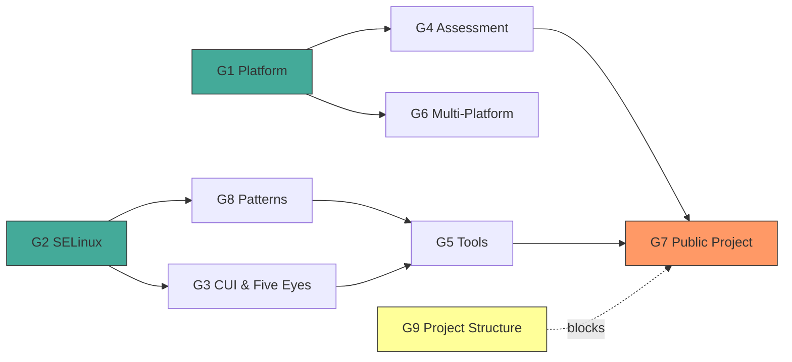

# UMRS ROADMAP

**Updated:** 2026-03-15

High-assurance Rust platform for system security on Linux.
Typed, provenance-verified answers about what a system is, what it runs, and whether it meets policy.

---

## How We Got Here

Started with MLS labeling of CUI — one library, one problem.
That led to discovering high-assurance programming patterns (TPI, TOCTOU, provenance).
Which led to high-assurance operations — tools that demonstrate those patterns.
Which led to strong security controls with real evidence backing everything.

Now UMRS is four interrelated things:
- **Libraries** — reusable Rust crates for SELinux, platform detection, MLS math
- **Patterns** — how to write high-assurance Rust, with real examples
- **Tools** — CLI tools for security operators
- **Assessment** — auditor-ready evidence with compliance backing

---

## Goals

- **G1 — Platform Awareness**: Know the system with proof (OS, kernel posture, CPU extensions, crypto)
- **G2 — SELinux / MLS Modeling**: Clean-room typed Rust for security contexts, MLS, lattice math
- **G3 — CUI & Five Eyes**: CUI labeling, CMMC, allied nation interop
- **G4 — Assessment Engine**: Auditor-ready evidence, findings, OSCAL export — not a scanner
- **G5 — Security Tools**: `umrs-ls`, `umrs-state`, `umrs-logspace` — enriched CLI tools
- **G6 — Multi-Platform**: RHEL primary, Ubuntu secondary, graceful degradation
- **G7 — Public Project**: Docs, CI/CD, crates.io, contribution guide, compelling narrative
- **G8 — High-Assurance Patterns**: The pattern library as a first-class product, not just docs

### Goal Dependencies

- G1 feeds G4: platform awareness provides evidence for assessment
- G2 feeds G3: MLS modeling underpins CUI labeling
- G8 feeds G5: patterns are demonstrated through tools
- G4 + G5 feed G7: public project needs working assessment and tools
- G9 blocks parts of G7: can't publish to crates.io without deciding repo structure

### G9 — Project Structure (decision pending)

The project may need to split into multiple repos for crates.io, GitHub Pages,
and contributor clarity. Decision captured in `.claude/plans/project-restructure.md`.
Not blocking current work. Blocks M4.

---

## Milestones

### M1 — Solid Foundation (current)
- [x] OS detection with trust tiers
- [x] SELinux modeling (SecurityContext, MLS, CategorySet, SecureDirent)
- [ ] Kernel posture probe complete (through Phase 2b)
- [ ] CPU corpus research complete
- [ ] Security-auditor methodology corpus ingested
- [ ] Documentation restructure complete

### M2 — Assessment Capable
- [ ] Assessment engine v1 (evidence/assertion/finding pipeline)
- [ ] OSCAL export working
- [ ] CPU extension detection (three-layer model)
- [ ] Multi-platform T3 on Ubuntu

### M3 — CUI Ready
- [ ] CUI label definitions
- [ ] MCS translation
- [ ] Five Eyes interop mapping

### i18n Support for Demonstration
- [ ] French translations for all tool domains
      French chosen simply because of Five Eyes.

### M4 — Public Release
- [ ] Project structure decided (see G9)
      - May mean different GitHub repositories
      - Repository work needed
- [ ] README, getting-started guide, contribution guide
- [ ] CI/CD pipeline
- [ ] Core crates on crates.io
- [ ] Documentation and API available on GitHub Pages

---

## Principles

1. **Security over convenience**
2. **Evidence over claims**
3. **Types over strings**
4. **Rust over FFI**
5. **Approachable over intimidating**
6. **Iterative over perfect**

---

## Notes

- Plans live in `.claude/plans/` — they reference goals (G1-G9) to justify their existence
- Features can move between milestones
- Jamie owns this doc and updates it when priorities shift
