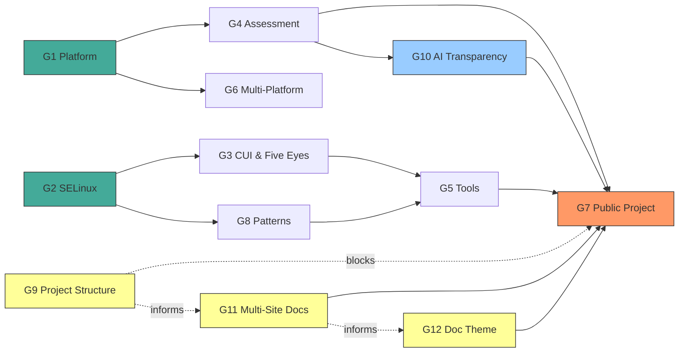

# UMRS ROADMAP

**Updated:** 2026-04-02

High-assurance Rust platform for system security on Linux.
Typed, provenance-verified answers about what a system is, what it runs, and whether it meets policy.

---

## How We Got Here

Started with MLS labeling of CUI — one library, one problem.
That led to discovering high-assurance programming patterns (TPI, TOCTOU, provenance).
Which led to high-assurance operations — tools that demonstrate those patterns.
Which led to strong security controls with real evidence backing everything.

Now UMRS is four interrelated things:
- **Libraries** — reusable Rust crates for SELinux, platform detection, MLS math
- **Patterns** — how to write high-assurance Rust, with real examples
- **Tools** — CLI tools for security operators
- **Assessment** — auditor-ready evidence with compliance backing

---

## Goals

- **G1 — Platform Awareness**: Know the system with proof (OS, kernel posture, CPU extensions, crypto)
- **G2 — SELinux / MLS Modeling**: Clean-room typed Rust for security contexts, MLS, lattice math
- **G3 — CUI & Five Eyes**: CUI labeling, CMMC, allied nation interop
- **G4 — Assessment Engine**: Auditor-ready evidence, findings, OSCAL export — not a scanner
- **G5 — Security Tools**: `umrs-ls`, `umrs-state`, `umrs-logspace` — enriched CLI tools
- **G6 — Multi-Platform**: RHEL primary, Ubuntu secondary, graceful degradation
- **G7 — Public Project**: Docs, CI/CD, crates.io, contribution guide, compelling narrative
- **G8 — High-Assurance Patterns**: The pattern library as a first-class product, not just docs
- **G10 — AI Transparency**: Document how AI agents are used, how knowledge is sourced, and how decisions trace back to authoritative material

### Goal Dependencies

- G1 feeds G4: platform awareness provides evidence for assessment
- G2 feeds G3: MLS modeling underpins CUI labeling
- G8 feeds G5: patterns are demonstrated through tools
- G4 + G5 feed G7: public project needs working assessment and tools
- G4 feeds G10: assessment methodology informs how we document AI knowledge provenance
- G10 feeds G7: AI transparency documentation is part of the public project story
- G9 blocks parts of G7: can't publish to crates.io without deciding repo structure
- G9 informs G11: repo layout decisions affect where Antora site directories live
- G11 feeds G7: multi-site docs improve navigation and ownership for public release

### G9 — Project Structure (decision pending)

The project may need to split into multiple repos for crates.io, GitHub Pages,
and contributor clarity. Decision captured in `.claude/plans/project-restructure.md`.
Not blocking current work. Blocks M4.

### G11 — Multi-Site Documentation Architecture (planned)

The six Documentation Sets defined in `docs/modules/ROOT/pages/index.adoc` may each
become their own Antora site, replacing the current single-site/multi-module layout:

| Documentation Set | Current modules | Proposed site |
|---|---|---|
| The UMRS Project | ROOT, architecture (history), glossary | `docs/umrs-project/` |
| UMRS CUI Labeling | security-concepts, architecture (MLS/CUI) | `docs/umrs-cui-labeling/` |
| UMRS Operations | deployment, operations, umrs-tools, logging-audit | `docs/umrs-operations/` |
| UMRS High-Assurance Development | devel, patterns, cryptography | `docs/umrs-ha-development/` |
| UMRS Use of AI | ai-transparency | `docs/umrs-ai/` |

**No standalone References site.** Reference material is distributed to the site it serves:
- Development references (rust-style-guide, secure-bash, secure-python, compliance-frameworks, cpu-extensions) → HA Development
- Operations references (kernel-probe-signals, SELinux reference pages) → Operations
- Historical/conceptual references (glossary) → The UMRS Project
- CUI references (cui-descriptions, cui-abbreviations, MLS registry) → CUI Labeling

Each site gets its own `antora.yml`, modules, and nav — enabling independent versioning,
focused navigation, and clearer ownership boundaries. Sites are aggregated by the Antora
playbook into a unified published output.

**Execution:** senior-tech-writer to produce the migration plan. Jamie is actively refining
the content scope of each set (see the index.adoc table) and will signal when the boundaries
are stable enough to execute.

**Dependency:** G9 (project structure) informs this — repo layout decisions affect where
site directories live.

### G12 — Documentation Theme & Visual Identity (planned)

The current Antora theme is the default — plain white, generic, indistinguishable from
any other project's docs. It does not reflect what UMRS is about: security, precision,
the wizard mascot, the mystique of high-assurance engineering.

**The problem:** A project about MLS, Bell-LaPadula, and kernel-level enforcement should
not look like a SaaS onboarding guide. The visual identity should communicate trust,
craft, and depth — the same qualities the code demands.

**What we want:**
- Dark theme with security-appropriate aesthetics (think terminal green, muted blues, subtle glow)
- The wizard mascot integrated into the brand — header, favicon, 404 page
- Typography that says "precision engineering," not "corporate blog"
- Color accents that echo the TUI's security posture indicators (green/amber/red)
- A visual identity that makes someone landing on the docs think "these people take security seriously"

**Approach:** Antora supports custom UI bundles. Build a custom theme that replaces the
default. This is primarily frontend/design work — HTML templates, CSS, SVG assets.

**Dependency:** G11 (multi-site architecture) should be decided first so the theme
applies consistently across all sites.

---

## Milestones

### M1 — Solid Foundation — COMPLETE (2026-03-23) (G1, G2, G8)
- [x] OS detection with trust tiers
- [x] SELinux modeling (SecurityContext, MLS, CategorySet, SecureDirent)
- [x] Kernel posture probe complete (Phase 2c — 2026-03-17)
- [x] CPU corpus research complete (60 files, 645 RAG chunks — 2026-03-18)
- [x] Security-auditor methodology corpus ingested (Phase 3 — 2026-03-17)
- [x] Documentation restructure complete (2026-03-12)

### M2 — Assessment Capable (current) (G1, G4, G6)
- [ ] Assessment engine v1 (evidence/assertion/finding pipeline)
- [ ] OSCAL export working
- [ ] CPU extension detection (three-layer model)
- [ ] Multi-platform T3 on Ubuntu

### M3 — CUI Ready (G3)
- [ ] CUI label definitions
- [ ] Canadian CUI equivalent labels (3 basic labels — Five Eyes interop)
- [ ] MCS translation
      - Install utility to choose CUI categories and optional Five Eyes
- [ ] Five Eyes interop mapping
- [x] French translation pipeline operational (Termium Plus + OQLF GDT corpus, 58K entries — 2026-03-23)
- [x] First tool domain translated: umrs-uname fr_CA (Canadian federal security French — 2026-03-23)
- [x] umrs-c2pa fr_CA man page translated, Henri policy-reviewed, findings fixed (2026-04-01)
- [x] umrs-c2pa string inventory complete (105 strings, 5 design decisions — all 5 resolved by Jamie)
- [x] umrs-c2pa gettext wrapping in progress (2026-04-02) — all design blockers cleared
- [x] FIPS 180-4 and FIPS 186-5 downloaded to reference library (2026-04-02)
- [x] Audit/logging research corpus acquisition started (CC Part 2, IDMEF, CEF, DFXML, CASE, ITU X.721)
- [ ] French translations for remaining tool domains (umrs-ls, umrs-stat, umrs-platform)
- [ ] Extending label information to external systems:
      - Apache module which can read the SELinux label adn then add an http header to indicate
        the file being servied is CUI and deserves awareness.
      - If Linux server is running Samba with labeled files:
        - Use the alternate data stream (ADS) in the file's extended attributes to hold labeling

### M3.5 — Full Deployment (G5, G6)

First release uses `~/.local/bin` to lower the barrier and get people interested.
Full deployment moves binaries into OS-standard locations with proper access controls.

- [ ] Install to `/usr/local/bin` or `/usr/bin` (RPM-managed)
- [ ] SELinux type enforcement: define `umrs_exec_t`, domain transitions, file contexts
- [ ] fapolicyd trust entries (STIG-compliant hosts block `~/.local/bin` by default — CCE-89813-0)
- [ ] AIDE monitoring rules for UMRS binaries (CCE-86441-3, CCE-90260-1)
- [ ] CUI custody file contexts (`umrs_cui.fc` path entries — currently empty)
- [ ] RPM packaging with `semodule -i` in `%post` scriptlet
- [ ] Ubuntu `.deb` equivalent (no SELinux, graceful degradation)
- [ ] Deployment documentation in `docs/modules/deployment/`

**Deployment architecture findings are tracked here**, not in current development milestones.
The security-engineer's policy gap findings (e.g., missing `umrs_exec_t`, fapolicyd) land
in this milestone when the project moves from user-local to system-installed.

### M4 — Public Release (G7, G9, G11, G12)
- [ ] Project structure decided (see G9)
      - May mean different GitHub repositories
      - Repository work needed
- [ ] README, getting-started guide, contribution guide
- [ ] CI/CD pipeline
- [ ] Core crates on crates.io
- [ ] Source code comments reviewed by tech-writer and security-auditor
- [ ] Documentation and API available on GitHub Pages
- [ ] Multi-site documentation architecture (G11) — each Documentation Set as its own Antora site
- [ ] Custom documentation theme (G12) — visual identity reflecting security, the wizard, and the project's character

### M5 — AI Transparency (G10)
- [x] Antora module: `ai-transparency` (2026-03-15)
- [x] Agents and their roles (2026-03-15 — agent-roles.adoc with aliases)
- [x] Corpus/RAG pipeline operational — 33 collections, 36,898 chunks, rag-inventory skill (2026-03-23)
      - Document every collection, its sources, and why it exists
      - The pipeline: Jamie identifies knowledge gap → researcher acquires → corpus built →
        familiarization skill has target agent read it → agent produces grounded work
- [x] Agent familiarization process demonstrated — Elena/Rusty/Herb reflections (73K words, 2026-03-23)
- [x] Simone corpus case study — agent identifies own quality gap, directs infrastructure (2026-03-23)
- [ ] Knowledge provenance: how security claims trace back to authoritative sources
- [ ] Roadmap, plans, tasks, and the jamies_brain/new-stuff intake concept
- [ ] Workflow and feedback — how we ensure agents get what they need
- [ ] Skills catalog — what each skill does and why it exists
- [ ] Evidence value — why this matters to auditors (decision traceability, source attribution)

---

## Operations & Tools

Tools are a primary deliverable — they demonstrate the patterns, produce the evidence,
and give operators something to run. The security-auditor owns operations documentation:
how tools are deployed, how often they run, what their output means, and how findings
are escalated.

### Tool Inventory

| Tool | Crate | Purpose | Status | Operates On |
|---|---|---|---|---|
| `umrs-ls` | `umrs-ls` | Security-enriched directory listing — SELinux labels, xattrs, security observations | Functional | Files, directories |
| `umrs-state` | `umrs-state` | System state introspection — kernel posture, platform detection, security signals | Prototype | Host system |
| `umrs-logspace` | `umrs-logspace` | Audit trail and logging — structured security event capture | Prototype | Audit events |
| `umrs-c2pa` | `umrs-c2pa` | C2PA media provenance — chain-of-custody, trust list validation, CUI marking, SHA-256+SHA-384 dual digest (CNSA 2.0 ready) | Functional (43 tests, security-reviewed, EN+FR docs, i18n in progress) | Media files (JPEG, PNG, MP4, PDF) |

### Suggested Tool Enhancements

- **umrs-file-stat** (in development)
  - Beyond MIME type, identify ELF information: library vs binary, stripped status, etc.
  - Package provenance: package name, version, install date, checksum/hash verification status
    - Install date reveals whether a file is a recent patch — also explains why integrity checks are alerting
    - File type: is it marked as `%config` in the RPM database?
  - Best-guess file purpose analysis:
    - Use the Linux FHS to classify files as system binaries/libraries based on path
    - Superficial content inspection for additional classification
    - Detect whether the file is a systemd-managed daemon
    - Goal: understand system impact if this file has integrity problems
- **umrs-os-detect** (in development)
  - Adding security-related kernel flags tab
  - CPU extension information
- **All tools**: enable systemd-journald audit logging
  - Provide an evidence tab in each tool's output
- **Report export**: tools should be able to save findings as bundled reports with evidence
  - Format TBD — check with security-auditor for assessment requirements
  - Better than an auditor scraping the screen and copying/pasting
- **Integrated help**: in-tool help system (pop-up scrollable panels in TUI?)
  - Complement Antora operations docs with man pages for CLI tier
- If the security posture is not-so-good, the ascii art logo in the upper corner changes to a red.
  If okay, green. It would be funny to equate its mood to the posture. 
- If there findings or the security posture isn't good, we should have a findings tab
  to indicate what was wrong the related security control. 
  - It owuld be nice to pop-up the text of the security control. This might be an enormous
    undertaking so let's just iniitally estimate the level of effort. It doesn't have to be 
    entire text of thecontrol -- just a meaningful snippet so they undertand why the control
    isn't satisified.

### Planned Tools

| Tool | Purpose | Depends On | Milestone |
|---|---|---|---|
| Posture probe CLI | Run kernel/CPU posture checks, produce evidence snapshots | G1 platform awareness, posture probe complete | M2 |
| Assessment reporter | Generate findings reports, OSCAL export | G4 assessment engine | M2 |
| Event viewer (TUI/GUI) | Read and display structured JSON event logs from journald; acknowledge events | G5 tools, event logging infrastructure | M2+ |
| CUI label installer | Choose CUI categories and optional Five Eyes markings | G3 CUI labeling | M3 |
| MCS translator CLI | Human-readable MCS category translation | G2 SELinux/MLS modeling | M3 |
| `umrs-systemd` | Systemd service inspector (read-only) — unit hardening audit, seccomp profile analysis, service config review, dependency graph | G1 platform awareness, G5 tools | M2+ |

The current `umrs-ls` tool is pure CLI. Next step is an interactive TUI:
- Data display area with up/down navigation, highlighting the selected row
- Pressing Enter on a:
  - **Directory**: refresh the TUI showing the selected directory's contents
  - **Permission denied**: pop-up message informing the user
  - **Non-regular file** (device, symlink): pop-up explaining the file type cannot be inspected
  - **Regular file**: launch `umrs-file-stat` report card as a focused sub-panel (not full screen); returns focus to `umrs-ls` on exit

### Interface Roadmap

All tools will progress through interface tiers as they mature:
- **CLI** — first delivery, scriptable, evidence-producing (Secondory)
- **TUI** — interactive terminal interface for operators (PRIMARY)
- **GUI** — eventual graphical interface for broader adoption (Last)

### Event Logging Architecture

All UMRS tools emit structured JSON events to systemd-journald. This is the foundation
for audit trails, prescribed routine audits, and the event viewer.

- **Transport**: systemd-journald (all tool binaries use `systemd-journald` logging)
- **Format**: Structured JSON event records
- **Configuration**: Jamie will provide journald/rsyslogd instructions for JSON structured log capture
- **boot_id**: Events are correlated by systemd boot_id for session continuity

**Event acknowledgement pattern:**
- Some log entries are marked as **acknowledgement required**
- Through the event viewer (TUI/GUI), an operator can acknowledge a previous event
- The acknowledgement is emitted as a **new event** that pairs with the original
- This creates an auditable acknowledgement chain: event → ack event, linked by boot_id
- Prescribed routine audits (per security-auditor recommendations) generate events
  that require operator acknowledgement

### Prescribed Routine Audits

The security-auditor defines prescribed audit routines — scheduled checks that tools
execute automatically per CA-7 monitoring frequency. These routines:
- Run posture checks, evidence collection, or compliance scans on a defined schedule
- Emit structured JSON events to journald
- Flag findings that require operator acknowledgement
- Produce evidence trails that satisfy assessment requirements (SP 800-53A)

### Operational Scope (security-* team owned)

The security-engineer, security-auditor, and guest-admin collectively own the operational
side of every tool. Developers build; the security team evaluates, defines operational
use, and drives enhancement.

**For each delivered tool, the security team:**
- **Evaluates output** — is the information correct, complete, and actionable for operators?
- **Evaluates usability** — across CLI, TUI, and GUI: is the interface clear, the output
  readable, the workflow intuitive? Does it serve both security administrators and auditors?
- **Defines monitoring frequency** — how often the tool runs (CA-7 ODP)
- **Assesses evidence sufficiency** — does the output satisfy assessment requirements?
- **Defines finding escalation** — what severity triggers what response, and how fast
- **Reviews tool effectiveness** — periodic evaluation: are findings actionable? Is the
  tool producing value or noise?
- **Recommends high-assurance enhancements** — what needs to be stronger, based on
  assessment methodology and operational experience

**Feedback loop:** Developer builds interface → security team evaluates output and
usability → findings drive the next iteration. This applies to every interface tier
(CLI → TUI → GUI) for every tool.

---

## Principles

1. **Security over convenience**
2. **Usability co-equal with security** — the most secure tool is worthless if operators can't use it, misread it, or avoid it
3. **Evidence over claims**
4. **Types over strings**
5. **Rust over FFI**
6. **Explain, don't abbreviate** — output, logs, and interfaces should tell a story a human can follow
7. **Approachable over intimidating**
8. **Iterative over perfect**

---

## Notes

- Plans live in `.claude/plans/` — they reference goals (G1-G10) to justify their existence
- Features can move between milestones
- Jamie owns this doc and updates it when priorities shift
