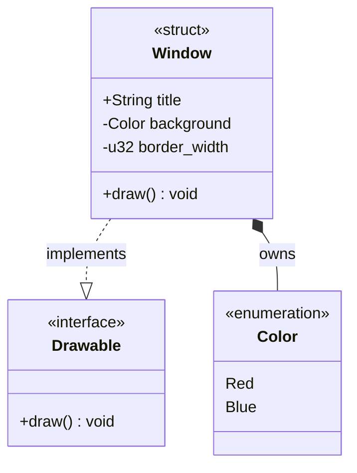

# Rust-to-UML Skill

Translate Rust source code into standards-compliant UML Class Diagrams using
Mermaid.js syntax, following a consistent structural mapping.

## When to Use

Use this skill when documenting Rust source code and you need to:

| Situation | Example |
|---|---|
| **Module overview** | Diagramming all types in `umrs-selinux/src/mls/` |
| **Type relationships** | Showing ownership and trait impls for `SecurityContext` |
| **Architecture docs** | Adding structural diagrams to `docs/modules/devel/` pages |
| **Pattern illustrations** | Visualizing high-assurance pattern implementations |
| **API documentation** | Showing how public types compose and relate |
| **Code review** | Understanding complex type hierarchies visually |

## Mapping Rules

### 1. Visibility Modifiers

| Rust Keyword | UML Symbol | Description |
|---|---|---|
| `pub` | `+` | Public: Accessible outside the module/crate |
| *(none)* | `-` | Private: Module-private (default) |
| `pub(crate)` | `~` | Package: Visible only within the current crate |
| `pub(super)` | `#` | Protected: Visible to the parent module |

### 2. Component Stereotypes

Use Mermaid stereotypes (`<<...>>`) to distinguish Rust constructs:

- **Structs**: `class Name { <<struct>> }`
- **Traits**: `class Name { <<interface>> }`
- **Enums**: `class Name { <<enumeration>> }`

### 3. Methods and Members

- **Instance fields**: `[Symbol][Type] [Name]` — e.g., `-u32 id`
- **Instance methods**: `[Symbol][Name]([Args]) [Return]` — e.g., `+get_data(u32) String`
- **Static/associated functions**: Append `$` — e.g., `+new()$ Self`
- **Generics**: Tilde syntax — `class Container~T~`

### 4. Relationship Arrows

Rust has no inheritance. Map relationships to ownership, references, and implementations:

| Relationship | Rust Concept | Mermaid Syntax |
|---|---|---|
| Realization | `impl Trait for Struct` | `Struct ..\|> Trait : implements` |
| Composition | Owned field (`self.x = X`) | `Parent *-- Child` |
| Aggregation | Reference (`&T`, `Box<T>`, `Rc<T>`) | `Parent o-- Child` |
| Dependency | Usage in function params | `A --> B` |

### 5. Enums with Data

For enums with associated data (e.g., `Variant(u32)`), represent variants as
members with their payload types noted. For complex enum variants with named
fields, consider linking to a separate struct diagram.

## Workflow

1. **Read the Rust source** — identify all structs, traits, enums, and impl blocks
2. **Map visibility** — apply UML symbols per the table above
3. **Map stereotypes** — tag each type with its archetype
4. **Map fields and methods** — include visibility, types, and static markers
5. **Map relationships** — trace ownership, references, and trait impls
6. **Generate Mermaid block** — wrap in a `classDiagram` code fence
7. **Embed in AsciiDoc** — use a Mermaid block or link to a rendered image

## Example

Given this Rust source:

```rust
pub trait Drawable { fn draw(&self); }
pub enum Color { Red, Blue }
pub struct Window {
    pub title: String,
    background: Color,
    border_width: u32,
}
impl Drawable for Window {
    fn draw(&self) { /* ... */ }
}
```

Generate this Mermaid diagram:



## AsciiDoc Embedding

When adding diagrams to Antora pages, use a code block with source type:

```asciidoc
[source,mermaid]
----
classDiagram
    ...diagram content...
----
```

Or for pages that render Mermaid natively:

```asciidoc
[mermaid]
....
classDiagram
    ...diagram content...
....
```

## Tips

- Keep diagrams focused — one module or one feature area per diagram
- For large modules, split into multiple diagrams rather than one giant graph
- Label relationship arrows with short descriptions (`: owns`, `: implements`)
- Order types top-down: traits first, then enums, then structs
- When documenting `umrs-selinux`, pay attention to the `CategorySet` fixed-size
  array pattern and the dual-parser TPI pattern — these are high-assurance
  patterns worth calling out visually
