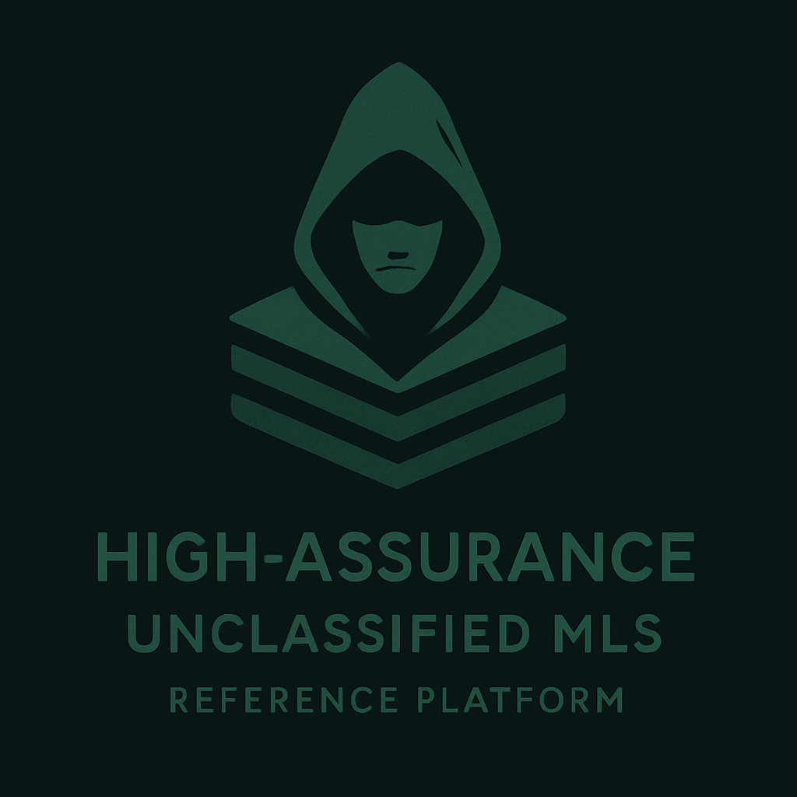

# UNCLASSIFIED MLS Reference System Project

The Unclassified MLS Reference System (UMRS) is an ongoing high assurance engineering project built on top of Red Hat Enterprise Linux 10 operating in FIPS mode. The system is fully STIG-locked, configured for SELinux MLS with a complete unclassified label hierarchy, and structured to demonstrate—not merely describe—how a real organization can tailor, customize, and extend a commercial Linux distribution to satisfy its own security requirements.

Conceptual idea of an Unclassified Senstivity label heirarchy (These exact labels are subject to change. They are only provided as examples to help understand the structure):

| Sensitivity&nbsp;Level           | Description             |
|:--------------------------------:|:------------------------|
| GENERAL           |The broad “general unclassified” level — suitable for anything openly unclassified, routine, not requiring special controls.|
| PUBLIC            |Intended for material that is still unclassified but suitable for public dissemination, documentation, public website assets, etc.|
| U&#8209;CONTROLLED      |This is not the same as CUI but it is at the top of our unclassified-only MLS hierarchy. In general, it is unclassified, but is tightly controlled and subject to explicit handling, integrity, and confidentiality expectations. This level models what many organizations approximate as “CUI” within an unclassified environment.|

>[!Important]
> Controlled Unclassified Information (CUI) is not an MLS label in the traditional sense or a clearance. Instead, it is a handling framework for unclassified data that still requires protection.
>
> 
It was created to standardize how the U.S. government handles sensitive but unclassified information that previously went by many inconsistent labels (FOUO, SBU, LES, etc.). For clarity, we match attach *category* (e.g., c0) labels to drill this down.|

>
> CUI applies to information, not to people, systems, or clearance levels. CUI's Authoritative source defined by Executive Order 13556 (2010) and the official public authority is the National Archives (NARA) CUI program.[^1]

Many organizations simply deploy an operating system *as shipped*, never realizing how much value and correctness they can add through careful customization. This reference system exists to show system administrators, engineers, and security teams that they can adapt and strengthen the platform for their own enterprise needs while still maintaining verifiability, accreditation readiness, and rigorous operational integrity.

The goal of UMRS is not just to lock down the OS but to demonstrate high-assurance engineering practices. Hardening is widely documented; however, high-assurance engineering goes beyond configuration checklists. It provides evidence that the system behaves as intended, continues to behave as intended, and can prove that fact to third parties. 

As we develop components for UMRS—such as key inventory tooling, audit-log signing and chaining, MLS configuration interfaces, FIPS-state inspection utilities, and other trusted administrative capabilities—we will accompany each feature with explicit mappings to applicable NIST controls, STIG requirements, and any other relevant security guidance. This helps users understand not only how to configure their systems, but how those configurations satisfy real accreditation demands.

Every high assurance-engineering effort inside the UMRS project will describe which security controls it helps address and why. For example, inventorying cryptographic signing keys relates directly to assurance around trusted code paths, cryptographic integrity, privileged operations, and auditability. A verifiable audit-log signing chain relates to tamper-evidence, forensic readiness, and incident response controls. MLS administrative safeguards tie directly to mandatory access control requirements and separation-of-duty concepts. In every case, the intention is to show how these high assurance capabilities create evidence, not just configuration.

The UMRS will also demonstrate how to customized GNOME to include custom icons and tailored settings. The project will use UMRS-prefixed namespace in tool names, application programming interfaces, and purpose-driven administrative tools. This is simply to make it clear what came from this project and it was part of the original operating system. Each GUI or command-line utility in this system is not merely a convenience—it is an example of how organizations can build controlled, reviewable, testable, and accreditable security tooling atop their base operating system.

Ultimately, the Unclassified MLS Reference System aims to serve as a blueprint for organizations that want to go beyond compliance and reach genuine assurance. It will show how to construct systems where settings are not merely applied but validated, where integrity is not assumed but proven, and where the entire security posture is measurable, inspectable, and defensible. UMRS teaches not only what to secure, but how to demonstrate correctness, how to prove intent, and how to build a verifiable high assurance Linux environment suited for real-world accreditation and operational trust.

**Personalized Note:**
>[!Note]
> The UMRS project is released under the MIT license, and I genuinely want people to take advantage of that openness. If you find a tool, design pattern, script, or high-assurance technique in this project that helps your own environment, please take it—adapt it, refine it, and make it your own. That’s the whole point. I’m not protective of the artifacts; I want them to live in real systems and solve real problems.
> All I ask is that, if you do use portions of this work out in the world, let me know how it went. Feedback from actual operational environments only makes the project stronger, and it helps the entire community move toward better, more verifiable high assurance engineering practices.

---
[^1]: NARA CUI Registry: https://www.archives.gov/cui
